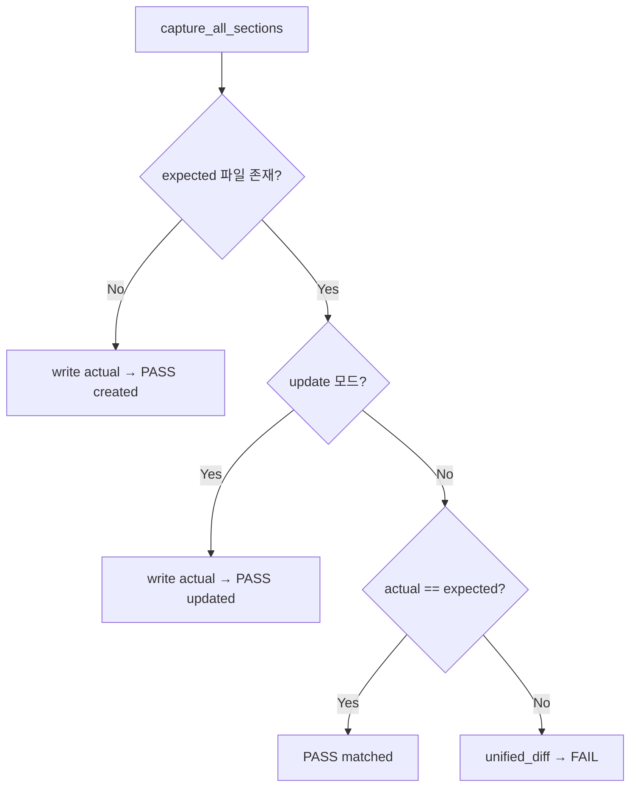

# Golden Master — Approve Pattern (GM-1)

Magic Square Solver 회귀 테스트용 Golden Master 기준 파일과 approve 패턴 설계.

## 목적

- **Track B** 회귀: `UIBoundary.solve()` 결과(성공 `data` / 실패 semantic `Error`)를 한 파일에 고정
- 구현 변경 시 **의도치 않은 출력 drift**를 unified diff로 즉시 감지
- NFR-08 준수: 16칸 완성 격자 전체가 아니라 **int[6] / Error 라벨**만 기준화

## 파일

| 경로 | 역할 |
|------|------|
| `tests/golden_master_expected.txt` | 버전 관리되는 기준 출력 (필수) |
| `tests/golden_master/capture.py` | 시나리오별 캡처·직렬화 |
| `tests/golden_master/approve.py` | approve 비교·자동 생성 |
| `tests/golden_master/scenarios.py` | 5개 입력 시나리오 정의 |
| `scripts/generate_golden_master_expected.py` | 기준 파일 재생성 CLI |
| `tests/test_golden_master.py` | pytest GM-1 회귀 |

## 입력 시나리오 (5)

| Section ID | 의미 | Grid 출처 |
|------------|------|-----------|
| `normal_success` | Step B 성공 (G2) | PRD §16.4 G2 |
| `reverse_success` | Step A 실패 → Step B (G1) | PRD §16.4 G1 |
| `invalid_blank_count` | 빈칸 수 ≠ 2 | G0 (0 blanks) |
| `duplicate_number` | 1..16 중복 | 전용 4×4 |
| `no_valid_solution` | E006 | G3 |

## 출력 캡처 방식

- **채택:** `SuccessResponse` / `FailureResponse` (Pydantic DTO) → 텍스트 블록
- **미사용:** `print` / stdout (forbidden 패턴·UI 의존 회피)

### 기준 파일 블록 형식

```text
[normal_success]
Input:
16 2 3 13
...
Output:
[3, 3, 6, 4, 4, 1]

[invalid_blank_count]
Input:
...
Error:
INVALID_BLANK_COUNT
```

실패 시 Boundary `error.code` (`E002`, `E005`, `E006`)를 GM 전용 semantic 라벨로 매핑:

| Code | GM Error 라벨 |
|------|----------------|
| E002 | `INVALID_BLANK_COUNT` |
| E005 | `DUPLICATE_NUMBER` |
| E006 | `NO_VALID_SOLUTION` |

## Approve 패턴



1. **기준 없음:** 현재 `actual`을 `tests/golden_master_expected.txt`에 기록 후 통과 (`created`).
2. **기준 있음:** `actual` vs `expected` 문자열 동일 비교.
3. **불일치:** `difflib.unified_diff`를 `AssertionError` 메시지에 포함 후 FAIL.

### 기준 갱신 (의도적 변경)

```bash
python scripts/generate_golden_master_expected.py
# 또는
pytest tests/test_golden_master.py --update-golden
# 또는
set GOLDEN_MASTER_APPROVE=1   # Windows
pytest tests/test_golden_master.py
```

갱신 후 `git add tests/golden_master_expected.txt`로 버전 관리에 포함.

## pytest (GM-2)

- 파일: `tests/test_golden_master_magic_square.py`
- 마커: `@pytest.mark.golden_master` / docstring `[TAG][GoldenMaster]`
- 실행: `pytest -m golden_master -v`
- TC: `GM-TC-01`..`GM-TC-05` (섹션별 approve + domain contract)
- 실패 시: `--- expected` / `+++ actual` unified diff (`difflib.unified_diff`)

| TC | Section | 검증 |
|----|---------|------|
| GM-TC-01 | `normal_success` | int[6], row-major, 1-index, Step B fallback |
| GM-TC-02 | `reverse_success` | 동일 + reverse 조합 |
| GM-TC-03 | `invalid_blank_count` | `INVALID_BLANK_COUNT` / E002 |
| GM-TC-04 | `duplicate_number` | `DUPLICATE_NUMBER` / E005 |
| GM-TC-05 | `no_valid_magic_square` | `NO_VALID_MAGIC_SQUARE` / E006 |

## 금지 패턴 정합

- 전체 16칸 **정답 격자** golden assert 없음 — `Output:` 은 int[6]만
- `@pytest.mark.skip` / assert 완화로 drift 숨기기 금지
- Red 제거 목적의 xfail 금지
